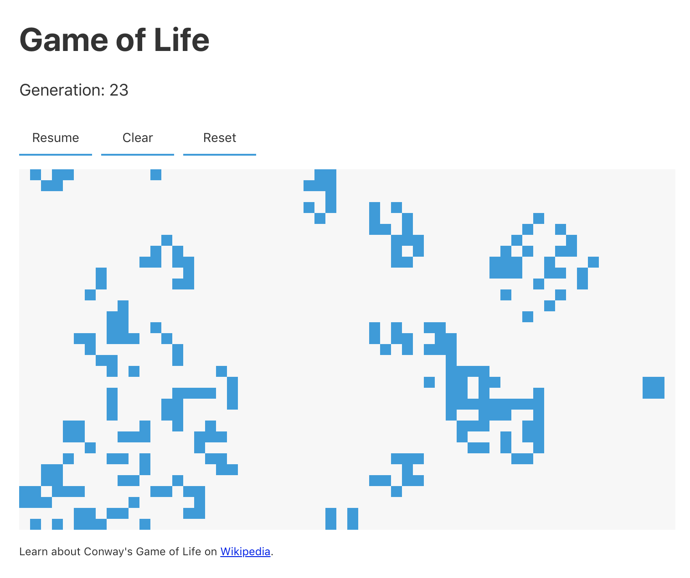

# Simulation of Conway's Game of Life

Demo: https://rpemberton.github.io/game-of-life

(This game is way too fast for a gif image. Play the demo instead!)

Sit back and watch evolution. Cells can be toggled alive/dead by clicking on the canvas. This works best when the game is paused.

Alternatively create a custom population by clearing the canvs and clicking individual cells.

# Tech
* React
* Canvas
* RequestAnimationFrame

# What's happening?
* Any live cell with fewer than two live neighbors dies, as if by underpopulation.
* Any live cell with two or three live neighbors lives on to the next generation.
* Any live cell with more than three live neighbors dies, as if by overpopulation.
* Any dead cell with exactly three live neighbors becomes a live cell, as if by reproduction.
